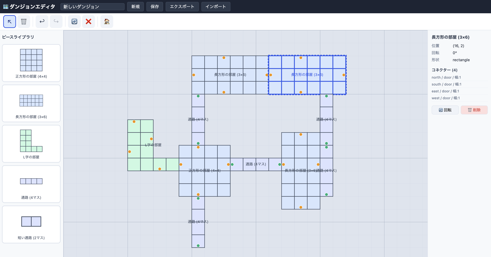
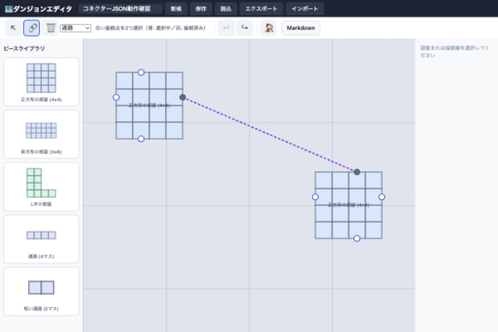

# TRPGダンジョンエディタ

TRPGのダンジョン自動生成＋編集ツール（MVP実装）



## 概要

React + TypeScript + Vite で構築した、ブラウザ上で動作するダンジョン編集ツールです。

## 機能

### キャンバス
- SVGによる方眼紙表示
- マウスホイールによる拡大・縮小
- 中ボタンドラッグまたはSpaceキー＋ドラッグでパン操作

### ピース
| 種別 | 説明 |
|------|------|
| 正方形の部屋 (4×4) | 標準的な正方形部屋 |
| 長方形の部屋 (3×6) | 横長の部屋 |
| L字の部屋 | L字形状の部屋 |
| 通路 (4マス) | 長い廊下 |
| 短い通路 (2マス) | 短い廊下 |

各ピースは以下の操作が可能：
- **配置**: サイドバーから選択 → キャンバスにクリック
- **移動**: ドラッグ
- **回転**: R キー または プロパティパネルの回転ボタン
- **削除**: Delete モードまたはプロパティパネルの削除ボタン

### コネクター
各ピースはコネクター（接続口）を持ちます。コネクターには以下の属性があります：
- **方向**: north / south / east / west
- **幅**: グリッドセル単位
- **種類**: open / door / secret / locked

### 手動接続（コネクターシステム MVP）

- ツールバーの 🔗 ボタン、または `C` キーで接続モードへ切り替える
- 異なる部屋の白い接続ポイントを2つクリックして接続を作成する
- ポイントは白が未接続、青が選択中、灰色が接続済み。1ポイントにつき1接続
- 同じポイントの再クリック、`Esc`、キャンセルボタンで始点の選択を解除する
- 新しい接続の種類は通路 / ドア / 階段 / 隠し通路から選択する
- 線を選択して右パネルの「接続を削除」、`Delete` / `Backspace`、または削除モードで線をクリックすると削除する
- 接続の作成・削除、部屋削除に伴う接続削除は Undo / Redo に対応する
- `V` キーで選択モードへ戻り、部屋を移動・回転すると線が追従する

接続は `DungeonDocument.connections` に部屋ID・固定コネクターID・種類を保存します。
直線の始点・終点は部屋の現在位置と回転から計算し、SVGや自動生成通路ピースは保存しません。
手動接続では距離・方向・幅・コネクター種類による制約を設けません。
既存の隣接コネクター候補判定は別用途のロジックとして残しています。



### 衝突判定
ピース配置時および移動時に、他のピースとの重なりを自動検出します。
重なりがある場合は赤色で表示され、配置できません。

### 保存
Dexie + IndexedDB を使用してブラウザローカルに保存します。
メニューバーの「保存」で保存し、「読込」で保存済みダンジョンを開きます。
ページ再読み込み後も「読込」から部屋・接続を復元できます。
読み込み時には現在の未保存の編集を置き換えます。

### Export / Import
JSON形式でエクスポート・インポートが可能です。
フォーマット識別子 `trpg-dungeon-generator` とスキーマバージョンを含みます。
現在のスキーマは `1.1.0` で、接続情報も含みます。従来の `1.0.0` を読み込み可能です。
接続情報のない旧データは空の接続一覧として読み込みます。
旧 `PlacedRoom.connections` に接続がある場合はドキュメント単位の接続へ移行し、
部屋単位のマップは除去します。詳細は [コネクター実装メモ](docs/connector-system.md) を参照してください。

### Markdown Editor
- ツールバーの `Markdown` ボタンから別ウィンドウで開く
- EasyMDE ベースの編集（Edit / Preview / Split）
- DungeonDocument に紐づく Markdown を Repository 経由で保存
- 1秒デバウンスの自動保存 + 手動保存
- `.md` のインポート / エクスポート
- Preview を使った PDF 出力（ブラウザ印刷）

### Undo / Redo
- `Ctrl+Z` で元に戻す（最大50履歴）
- `Ctrl+Y` または `Ctrl+Shift+Z` でやり直す

## 技術スタック

| 技術 | 用途 |
|------|------|
| React 19 | UIフレームワーク |
| TypeScript 6 | 型安全性 |
| Vite 8 | ビルドツール・開発サーバー |
| SVG | キャンバス描画 |
| Zustand 5 | 状態管理 (Undo/Redo含む) |
| Dexie 4 | IndexedDB ORM |
| uuid | ID生成 |

## ディレクトリ構成

```
src/
  model/          - TypeScript型定義・ピースライブラリ
  store/          - Zustand状態管理（Undo/Redo）
  db/             - Dexie DBセットアップ
  repository/     - データアクセス層
  editor/
    connectors/   - コネクター互換性ロジック
    collision/    - 衝突判定
  utils/
    geometry.ts   - 回転・座標変換ユーティリティ
    exportImport.ts - JSON Export/Import
  components/
    canvas/       - SVGキャンバス（グリッド・ズーム・パン）
    pieces/       - ピース描画・配置ゴースト
    connections/  - 直線描画・接続ポイントUI
    sidebar/      - ピースライブラリUI
    toolbar/      - ツールバー
    ui/           - メニューバー・プロパティパネル
    editor/       - エディタメインレイアウト
```

## 開発・実行

```bash
npm install
npm run dev      # 開発サーバー起動
npm run build    # プロダクションビルド
npm run lint     # Oxlint
npm test         # 接続・履歴・互換性・入出力・IndexedDBの回帰テスト
```

## データモデル

```typescript
// コネクター（接続口）
interface Connector {
  id: string;
  direction: 'north' | 'south' | 'east' | 'west';
  width: number;
  kind: 'open' | 'door' | 'secret' | 'locked';
  position: { x: number; y: number };
}

// ピーステンプレート
interface Piece {
  id: string;
  name: string;
  shape: 'rectangle' | 'l-shape' | 'corridor';
  cells: { x: number; y: number }[];
  connectors: Connector[];
  tags?: string[];
}

// キャンバス上の配置済みピース
interface PlacedRoom {
  id: string;
  pieceId: string;
  piece: Piece;
  position: { x: number; y: number };
  rotation: 0 | 90 | 180 | 270;
}

// 配置済み部屋同士の論理的な接続（座標は保存しない）
interface Connection {
  id: string;
  fromRoomId: string;
  fromConnectorId: string;
  toRoomId: string;
  toConnectorId: string;
  type: 'corridor' | 'door' | 'stairs' | 'secret';
}

// ダンジョンドキュメント
interface DungeonDocument {
  id: string;
  name: string;
  version: string;
  rooms: PlacedRoom[];
  connections: Connection[];
  markdown: string;
  meta: DungeonMeta;
  createdAt: string;
  updatedAt: string;
}
```

## 技術スタック採用理由

### React

コンポーネント指向でエディタUIを構築しやすく、

将来的な機能追加・分割が容易なため採用。

### TypeScript

型安全性を確保し、

ダンジョンデータやコネクターなど複雑なデータ構造を安全に扱うため採用。

### Vite

高速な開発サーバーとビルド速度を重視して採用。

### SVG

部屋や通路、コネクターをベクター形式で描画するため採用。

CanvasよりDOMとして扱いやすく、クリック判定や編集機能との相性が良い。

### Zustand

シンプルな状態管理ライブラリ。

Undo/Redoや選択状態など、エディタ向けの状態管理を容易に実装できる。

### Dexie

IndexedDBを扱いやすくするORM。

ブラウザだけで保存・読込ができ、将来的なオフライン編集にも対応できる。

### UUID

配置済み部屋やドキュメントを一意に識別するため採用。

## ロードマップ

### Phase1（MVP）

- [x] SVGキャンバス

- [x] ピース配置

- [x] Undo / Redo

- [x] Export / Import

### Phase2

- [x] 手動コネクター接続 MVP（直線・追従・保存・Undo / Redo）

- [ ] コネクター自動接続

- [ ] 自動ダンジョン生成

- [ ] ピース編集

### Phase3

- [ ] EncounterTemplate

- [ ] Monster配置

- [ ] Event配置

### Phase4

- [ ] Tauri版

- [ ] プラグイン対応
